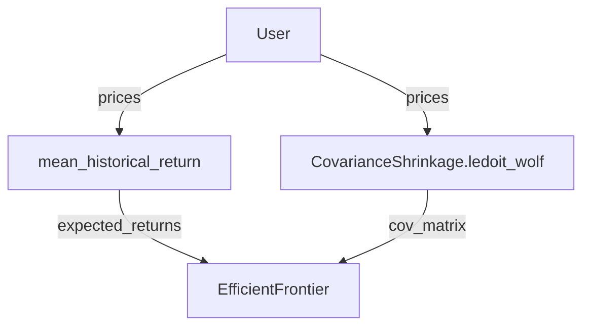

# Optimization

Portfolio optimization capabilities is the process of selecting the optimal mix of assets in a portfolio, with respect to the alpha scores, in order to maximize returns while minimizing risk. The `portfolio()` method has been implemented to streamline the process of optimization and facilitate the integration of backtesting.

The `portfolio()` calls the [`PortfolioConstruction`](../../portfolio/index.md) class, which includes the implementation of the following built-in public methods for optimization procedures:

* `add()` Add a new objectives and constraints to the optimization problem
* `optimize()` Base optimizer model

Which triggers **PyPortfolioOpt** inherited methods:

* `min_volatility()`: optimizes for minimum volatility
* `max_sharpe()`: optimizes for maximal Sharpe ratio (a.k.a the tangency portfolio)
* `max_quadratic_utility()`: maximises the quadratic utility, given some risk aversion
* `efficient_risk()`: maximises return for a given target risk
* `efficient_return()`: minimises risk for a given target return
* `clean_weights()`: rounds the weights and clips near-zeros

!!! sucess "PyPortfolioOpt"
    `pyportopt`: PyPortfolioOpt is a library that implements portfolio optimization methods, including classical efficient frontier techniques and Black-Litterman allocation, as well as more recent developments in the field like shrinkage and Hierarchical Risk Parity, along with some novel experimental features, like exponentially-weighted covariance matrices. 

## VBT Pro Integration

!!! info "Vectorbt Pro"
    This section is largely inspired from Vectorbt Pro and can be accessed through [subsription](https://vectorbt.pro/getting-started/#how-to-get-access).

PyPortfolioOpt implements a range of optimization methods that are very easy to use. The optimization procedure consists of several distinct steps (some of them may be skipped depending on the optimizer):

* Calculate the expected returns (mostly located in `pfopt.expected_returns`)
* Calculate the covariance matrix (mostly located in `pfopt.risk_models`)
* Initialize and set up an optimizer (mostly located in `pypfopt.efficient_frontier`, with the base class located in `pypfopt.base_optimizer) including objectives, constraints, and target
* Run the optimizer to get the weights
* Convert the weights into a discrete allocation (optional)

For example, let's perform the mean-variance optimization (MVO) for maximum Sharpe:

```python
from pypfopt.expected_returns import mean_historical_return
from pypfopt.risk_models import CovarianceShrinkage
from pypfopt.efficient_frontier import EfficientFrontier

expected_returns = mean_historical_return(data)
cov_matrix = CovarianceShrinkage(data).ledoit_wolf()
optimizer = EfficientFrontier(expected_returns, cov_matrix)
```

<div class="termy">
```console
$ weights = optimizer.max_sharpe()
$ weights
<span style="color: grey;">OrderedDict([
    ('ADAUSDT', 0.1166001117223088),
    ('BNBUSDT', 0.0),
    ('BTCUSDT', 0.0),
    ('ETHUSDT', 0.8833998882776911),
    ('XRPUSDT', 0.0)
])
</span>
```
</div>

### Parsing

The entire codebase of PyPortfolioOpt (with a few exceptions) has consistent argument and function namings, such that we can build a semantic web of functions acting as inputs to other functions. THerefore, the user just needs to provide the target function (e.g. `EfficientFrontier.max_sharpe`), and we can programmatically figure out the entire call stack having the pricing data alonw. If the user passes any additional keyword arguments, we can check which functions from the stack accept those arguments and automatically pass them.

For the example above, the web would be:



### Auto-optimization

Knowing how to parse and resolve function arguments, vectorbt implements a function `pypfopt_optimize`, which takes user requirements and translates them into function calls. The usage of this function cannot be easier!

<div class="termy">
```console
$ vbt.pypfopt_optimize(prices=data.get("Close"))
$ weights
<span style="color: grey;">{'ADAUSDT': 0.1166,
 'BNBUSDT': 0.0,
 'BTCUSDT': 0.0,
 'ETHUSDT': 0.8834,
 'XRPUSDT': 0.0}
</span>
```
</div>

In short, `pypfopt_optimize` triggers a waterfall of argument resolutions by parsing arguments, including the calculation of the expected returns and the risk model quantifying asset risk. Then, it adds objectives and constraints to the optimizer instance. Finally, it calls the target metric method (such as `max_sharpe`) or custom convex/non-convex objective using the same parsing procedure as we did above. If wanted, it can also translate continuous weights into discrete ones using `pypfopt.DiscreteAllocation`.

Since multiple PyPortfolioOpt functions can require the same argument that has to be pre-computed yet, pypfopt_optimize deploys a built-in caching mechanism. Additionally, if any of the arguments weren't used, it throws a warning (which can be mitigated by setting `silence_warnings` to True) stating that an argument wasn't required by any function in the call stack.

Below, we will demonstrate various optimizations done both using PyPortfolioOpt and vectorbt. Optimizing a long/short portfolio to minimise total variance:

=== "PyPortfolioOpt"
    ```python
    S = CovarianceShrinkage(data.get("Close")).ledoit_wolf()
    ef = EfficientFrontier(None, S, weight_bounds=(-1, 1))
    ef.min_volatility()
    weights = ef.clean_weights()

    ```

=== "vectorbt"
    ```python
    vbt.pypfopt_optimize(  
        prices=data.get("Close"),
        expected_returns=None,
        weight_bounds=(-1, 1),
        target="min_volatility"
    )
    ```

For the alpha blocks strategy at the top-down level, which aims to constraint portfolio depending on pre-modeled tilts, we can apply the pyportfolioopt `sector_constraints` as follow:

=== "PyPortfolioOpt"
    ```python
    from pypfopt.expected_returns import capm_return

    mu = capm_return(data)
    S = CovarianceShrinkage(data).ledoit_wolf()
    ef = EfficientFrontier(mu, S)
    ef.add_sector_constraints(sector_mapper, sector_lower, sector_upper)
    ef.max_sharpe()
    weights = ef.clean_weights()
    weights
    ```

=== "vectorbt"
    ```python
    vbt.pypfopt_optimize(  
        prices=data.get("Close"),
        expected_returns="capm_return",
        sector_mapper=sector_mapper,
        sector_lower=sector_lower,
        sector_upper=sector_upper,
    )
    ```

Optimizing a portfolio to maximise return for a given risk, subject to sector constraints, with an L2 regularisation objective:

=== "PyPortfolioOpt"
    ```python
    from pypfopt.objective_functions import L2_reg

    mu = capm_return(data.get("Close"))
    S = CovarianceShrinkage(data.get("Close")).ledoit_wolf()
    ef = EfficientFrontier(mu, S)
    ef.add_sector_constraints(sector_mapper, sector_lower, sector_upper)
    ef.add_objective(L2_reg, gamma=0.1)
    ef.efficient_risk(0.15)
    weights = ef.clean_weights()
    ```

=== "vectorbt"
    ```python
    vbt.pypfopt_optimize(  
        prices=data.get("Close"),
        expected_returns="capm_return",
        sector_mapper=sector_mapper,
        sector_lower=sector_lower,
        sector_upper=sector_upper,
        objectives=["L2_reg"],  
        gamma=0.1,  
        target="efficient_risk",
        target_volatility=0.15  
    )
    ```

Optimizing along the mean-semivariance frontier:

=== "PyPortfolioOpt"
    ```python
    from pypfopt import EfficientSemivariance
    from pypfopt.expected_returns import returns_from_prices

    mu = capm_return(data.get("Close"))
    returns = returns_from_prices(data.get("Close"))
    returns = returns.dropna()
    es = EfficientSemivariance(mu, returns)
    es.efficient_return(0.01)
    weights = es.clean_weights()
    ```

=== "vectorbt"
    ```python
    vbt.pypfopt_optimize(
        prices=data.get("Close"),
        expected_returns="capm_return",
        optimizer="efficient_semivariance",  
        target="efficient_return",
        target_return=0.01
    )
    ```

Minimizing transaction costs:

```python
initial_weights = np.array([1 / len(data.symbols)] * len(data.symbols))
```
=== "PyPortfolioOpt"
    ```python
    from pypfopt.objective_functions import transaction_cost

    mu = mean_historical_return(data.get("Close"))
    S = CovarianceShrinkage(data.get("Close")).ledoit_wolf()
    ef = EfficientFrontier(mu, S)
    ef.add_objective(transaction_cost, w_prev=initial_weights, k=0.001)
    ef.add_objective(L2_reg, gamma=0.05)
    ef.min_volatility()
    weights = ef.clean_weights()
    ```

=== "vectorbt"
    ```python
    vbt.pypfopt_optimize(  
        prices=data.get("Close"),
        objectives=["transaction_cost", "L2_reg"],
        w_prev=initial_weights, 
        k=0.001,
        gamma=0.05,
        target="min_volatility"
    )
    ```

Custom convex objective:

```python
import cvxpy as cp

def logarithmic_barrier_objective(w, cov_matrix, k=0.1):
    log_sum = cp.sum(cp.log(w))
    var = cp.quad_form(w, cov_matrix)
    return var - k * log_sum
```

=== "PyPortfolioOpt"
    ```python
    mu = mean_historical_return(data.get("Close"))
    S = CovarianceShrinkage(data.get("Close")).ledoit_wolf()
    ef = EfficientFrontier(mu, S, weight_bounds=(0.01, 0.3))
    ef.convex_objective(logarithmic_barrier_objective, cov_matrix=S, k=0.001)
    weights = ef.clean_weights()
    ```

=== "vectorbt"
    ```python
    vbt.pypfopt_optimize(  
        prices=data.get("Close"),
        weight_bounds=(0.01, 0.3),
        k=0.001,
        target=logarithmic_barrier_objective  
    )
    ```

Custom non-convex objective:

```python
def deviation_risk_parity(w, cov_matrix):
    cov_matrix = np.asarray(cov_matrix)
    n = cov_matrix.shape[0]
    rp = (w * (cov_matrix @ w)) / cp.quad_form(w, cov_matrix)
    return cp.sum_squares(rp - 1 / n).value
```

=== "PyPortfolioOpt"
    ```python
    mu = mean_historical_return(data.get("Close"))
    S = CovarianceShrinkage(data.get("Close")).ledoit_wolf()
    ef = EfficientFrontier(mu, S)
    ef.nonconvex_objective(deviation_risk_parity, ef.cov_matrix)
    weights = ef.clean_weights()
    ```

=== "vectorbt"
    ```python
    vbt.pypfopt_optimize(  
        prices=data.get("Close"),
        target=deviation_risk_parity,  
        target_is_convex=False
    )
    ```

Black-Litterman Allocation, where `viewdict` is integrated within alpha blocks methods (more to follow):

```python
sp500_data = vbt.YFData.fetch(
    "^GSPC", 
    start=data.wrapper.index[0], 
    end=data.wrapper.index[-1]
)
market_caps = data.get("Close") * data.get("Volume")
viewdict = {
    "ADAUSDT": 0.20, 
    "BNBUSDT": -0.30, 
    "BTCUSDT": 0, 
    "ETHUSDT": -0.2, 
    "XRPUSDT": 0.15
}
```

=== "PyPortfolioOpt"
    ```python
    from pypfopt.black_litterman import (
        market_implied_risk_aversion,
        market_implied_prior_returns,
        BlackLittermanModel
    )

    S = CovarianceShrinkage(data.get("Close")).ledoit_wolf()
    delta = market_implied_risk_aversion(sp500_data.get("Close"))
    prior = market_implied_prior_returns(market_caps.iloc[-1], delta, S)
    bl = BlackLittermanModel(S, pi=prior, absolute_views=viewdict)
    rets = bl.bl_returns()
    ef = EfficientFrontier(rets, S)
    ef.min_volatility()
    weights = ef.clean_weights()
    ```

=== "vectorbt"
    ```python
    vbt.pypfopt_optimize(  
        prices=data.get("Close"),
        expected_returns="bl_returns",  
        market_prices=sp500_data.get("Close"),
        market_caps=market_caps.iloc[-1],
        absolute_views=viewdict,
        target="min_volatility"
    )
    ```

Hierarchical Risk Parity:

=== "PyPortfolioOpt"
    ```python
    from pypfopt import HRPOpt

    rets = returns_from_prices(data.get("Close"))
    hrp = HRPOpt(rets)
    hrp.optimize()
    weights = hrp.clean_weights()
    ```

=== "vectorbt"
    ```python
    vbt.pypfopt_optimize(
        prices=data.get("Close"),  
        optimizer="hrp",
        target="optimize"
    )
    ```

### Argument groups

In cases where two functions require an argument with the same name but you want to pass different values to them, pass the argument as an instance of `pfopt_func_dict` where keys should be functions or their names, and values should be different argument values:

```python
vbt.pypfopt_optimize(  
    prices=data.get("Close"),
    expected_returns="bl_returns",  
    market_prices=sp500_data.get("Close"),
    market_caps=market_caps.iloc[-1],
    absolute_views=viewdict,
    target="min_volatility",
    cov_matrix=vbt.pfopt_func_dict({
        "EfficientFrontier": "sample_cov",  
        "_def": "ledoit_wolf"  
    })
)
```

## add

```python
Strategy.add(
    alpha_block_constraints: Optional[bool] = True,
    n_asset_constraints: Optional[int] = None,
    l2_regularization: Optional[bool] = True,
    gamma: Optional[int] = 2,
    custom_objectives: Optional[List[Tuple[Type, Dict[str, Any]]]] = None,
    custom_constraints: Optional[List[Type]] = None
) ->  opendesk.portfolio.PortfolioConstruction
```

Add a new objectives and constraints to the optimization problem.

### Parameters

``` markdown title="alpha_block_constraints"
Optional[bool] = True
```
<div class="result" markdown>
Alpha blocks core constraints. It adds constraints on the sum of weights of different groups of assets. Most commonly, these will be sector constraints. These constraints a particularly relevant when working with alpha blocks (top-down or bottom-up), as we aim to limit our exposure to paricular group of assets. Defaults to `True`.
</div>

``` markdown title="n_asset_constraints"
Optional[List[Type]] = None
```
<div class="result" markdown>
Number of assets in the portfolio constraints. Cardinality constraints are not convex, making them difficult to implement. However, we can treat it as a mixed-integer program and solve (provided you have access to a solver). for small problems with less than 1000 variables and constraints, you can use the community version of [CPLEX](https://en.wikipedia.org/wiki/CPLEX) available in python `pip install cplex`.

!!! warning "`n_asset_constraints`"
    This functionnality is still work in progress, as it requires external capabilities (`cplex`).
</div>

``` markdown title="l2_regularization"
Optional[bool] = True
```
<div class="result" markdown>
L2 regularisation, i.e $\gamma ||w||^2$, to increase the number of nonzero weights.

Mean-variance optimization often results in many weights being negligible, i.e the efficient portfolio does not end up including most of the assets. This is expected behaviour, but it may be undesirable if you need a certain number of assets in your portfolio. 

In order to coerce the mean-variance optimizer to produce more non-negligible weights, we add what can be thought of as a “small weights penalty” to all of the objective functions, parameterised by $\gamma$ (gamma). This term reduces the number of negligible weights, because it has a minimum value when all weights are equally distributed, and maximum value in the limiting case where the entire portfolio is allocated to one asset. We refer to it as L2 regularisation because it has exactly the same form as the L2 regularisation term in machine learning, though a slightly different purpose (in ML it is used to keep weights small while here it is used to make them larger).

!!! note "Gamma"
    In practice, $\gamma$ must be tuned to achieve the level of regularisation that you want. However, if the universe of assets is small (less than 20 assets), then gamma=1 is a good starting point. For larger universes, or if you want more non-negligible weights in the final portfolio, increase gamma.
</div>

``` markdown title="gamma"
Optional[int] = 2
```
<div class="result" markdown>
L2 regularisation parameter. Defaults to 2. Increase if you want more non-negligible weights
</div>

``` markdown title="custom_objectives"
Optional[List[Tuple[Type, Dict[str, Any]]]] = None
```
<div class="result" markdown>
List of lambda functions to add new term into the based objective function. This term must be convex, and built from cvxpy atomic functions.
</div>

``` markdown title="custom_constraints"
Optional[List[Type]] = None
```
<div class="result" markdown>
 List of lambda function (e.i. all assets <= 3% of the total portfolio = [lambda w: w <= .03]. This constraint must satisfy DCP rules, i.e be either a linear equality constraint or convex inequality constraint.
</div>

### Returns

`opendesk.portfolio.PortfolioConstruction` instance.

## optimize

```python
Strategy.optimize(
    model: str,
    cov_matrix_params: Dict[str, Any],
    expected_returns_params: Optional[Dict[str, Any]] = None,
    black_litterman: Optional[bool] = False,
    black_litterman_params: Optional[Dict[str, Any]] = None,
    weight_bounds: Optional[Tuple[int, int]] = (-1, 1),
    **kwargs
) ‑> opendesk.portfolio.PortfolioConstruction
```

Base optimizer model, allowing for the efficient computation of optimized asset weights. The portfolio method houses different optimization methods, which generate optimal portfolios for various possible objective functions and parameters.

!!! warning "New Object Instantiation"
    A new object should be instantiated if you want to make any change to objectives/constraints/bounds/parameters.

### Parameters

``` markdown title="model"
Optional[str] = "mvo"
```
<div class="result" markdown>
Type of optimizer to be used.
Type of optimization:

* `mvo`: Mean-variance optimization
* `hrp`: Hierarchical Risk Parity
  
Work in progress:

* `kelly`: Kelly criterion

</div>

``` markdown title="cov_matrix_params"
Dict[str, Any]
```
<div class="result" markdown>
Parameters to compute a covariance matrix:

* `method` (str): the risk model to use. Should be one of:
    * `sample_cov`
    * `semicovariance`
    * `exp_cov`
    * `ledoit_wolf`
    * `ledoit_wolf_constant_variance`
    * `ledoit_wolf_single_factor`
    * `ledoit_wolf_constant_correlation`
    * `oracle_approximating`
* `**kwargs`: Method specificities
</div>

``` markdown title="expected_returns_params"
Dict[str, Any]
```
<div class="result" markdown>
Parameters to compute an estimate of future returns:

* `method` (str): the return model to use. Should be one of:
    * `mean_historical_return`
    * `ema_historical_return`
    * `capm_return`
* `**kwargs`: Method specificities
</div>

``` markdown title="black_litterman"
 Optional[bool] = False
```
<div class="result" markdown>
Black-litterman integration.

Black-Litterman model takes a Bayesian approach to asset allocation. Specifically, it combines a prior estimate of returns (for example, the market-implied returns) with views on certain assets, to produce a posterior estimate of expected returns. It will then meaningfully propagate views, taking into account the covariance with other assets. 

The alpha blocks implementation works with the Black-Litterman absolute views, where views direction is extracted from the median of weight range and the magnitude is $1.96\sigma$ ($\sigma$ is the annualized volatility calculated from log returns).

!!! note "1.96 is Hardcoded"
    In probability and statistics, the 97.5th percentile point of the standard normal distribution is a number commonly used for statistical calculations. The approximate value of this number is 1.96, meaning that 95% of the area under a normal curve lies within approximately 1.96 standard deviations of the mean.
    
</div>

``` markdown title="black_litterman_params"
Optional[Dict[str, Any]] = None
```
<div class="result" markdown>

Black-Litterman parameters. It accepts the following variables:

* `pi` (np.ndarray, pd.Series, optional) – Nx1 prior estimate of returns, defaults to None. If pi=”market”, calculate a market-implied prior (requires market_caps to be passed). If pi=”equal”, use an equal-weighted prior.
* `omega` (np.ndarray or Pd.DataFrame, or string, optional) – KxK view uncertainty matrix (diagonal), defaults to None Can instead pass “idzorek” to use Idzorek’s method (requires you to pass view_confidences). If omega=”default” or None, we set the uncertainty proportional to the variance.
* `view_confidences` (np.ndarray, pd.Series, list, optional) – Kx1 vector of percentage view confidences (between 0 and 1), required to compute omega via Idzorek’s method.
* `tau` (float, optional) – the weight-on-views scalar (default is 0.05)
risk_aversion (positive float, optional) – risk aversion parameter, defaults to 1
* `market_caps` (np.ndarray, pd.Series, optional) – (kwarg) market caps for the assets, required if pi=”market”
* `risk_free_rate` (float, defaults to 0.02) – (kwarg) risk_free_rate is needed in some methods

</div>

``` markdown title="weight_bounds"
Optional[Tuple[int, int]] = (-1, 1)
```
<div class="result" markdown>
Minimum and maximum weight of each asset or single min/max pair if all identical, defaults to (-1, 1). If `weight_bounds=(-1, 1)`, allows short positions.
</div>

``` markdown title="kwargs"
Dict
```
<div class="result" markdown>
Model specificities.
</div>

### Returns

`opendesk.portfolio.PortfolioConstruction` instance.

## min_volatility

```python
Strategy.min_volatility() ‑> OrderedDict
```

Optimizes for minimum volatility

### Returns

`OrderedDict`, asset weights for the volatility-minimising portfolio.

## max_sharpe

```python
Strategy.max_sharpe(
    risk_free_rate: Optional[float] = 0.02
) ‑> OrderedDict
```

Maximise the Sharpe Ratio. The result is also referred to as the tangency portfolio, as it is the portfolio for which the capital market line is tangent to the efficient frontier.

This is a convex optimization problem after making a certain variable substitution. See [Cornuejols and Tutuncu (2006)](http://web.math.ku.dk/~rolf/CT_FinOpt.pdf) for more.

### Parameters

``` markdown title="risk_free_rate"
Optional[float] = 0.02
```
<div class="result" markdown>
Risk-free rate of borrowing/lending, defaults to 0.02. The period of the risk-free rate should correspond to the frequency of expected returns.
</div>

### Returns

`OrderedDict`, asset weights for the Sharpe-maximising portfolio.

## max_quadratic_utility

```python
Strategy.max_quadratic_utility(
    risk_aversion: Optional[int] = 1, 
    market_neutral: Optional[bool] = False
) ‑> OrderedDict
```

Maximise the given quadratic utility, i.e:

$$
\max_w w^T \mu - \frac \delta 2 w^T \Sigma w
$$

### Parameters

``` markdown title="risk_aversion"
Optional[int] = 1
```
<div class="result" markdown>
Risk aversion parameter (must be greater than 0), defaults to 1.
</div>

``` markdown title="market_neutral"
Optional[bool] = False
```
<div class="result" markdown>
whether the portfolio should be market neutral (weights sum to zero), defaults to False. Requires negative lower weight bound.
</div>

### Returns

`OrderedDict`, asset weights for the maximum-utility portfolio.

## efficient_risk

```python
Strategy.efficient_risk(
    target_volatility: float, 
    market_neutral: Optional[bool] = False
) ‑> OrderedDict
```

Maximise return for a target risk. The resulting portfolio will have a volatility less than the target (but not guaranteed to be equal).

### Parameters

``` markdown title="target_volatility"
float
```
<div class="result" markdown>
The desired maximum volatility of the resulting portfolio.
</div>

``` markdown title="market_neutral"
Optional[bool] = False
```
<div class="result" markdown>
whether the portfolio should be market neutral (weights sum to zero), defaults to False. Requires negative lower weight bound.
</div>

### Returns

`OrderedDict`, asset weights for the efficient risk portfolio.

## efficient_return

```python
Strategy.efficient_return(
    target_return: float, 
    market_neutral: Optional[bool] = False
) ‑> OrderedDict
```

Calculate the ‘Markowitz portfolio’, minimising volatility for a given target return.

### Parameters

```markdown title="target_return"
float
```
<div class="result" markdown>
The desired return of the resulting portfolio.
</div>

``` markdown title="market_neutral"
Optional[bool] = False
```
<div class="result" markdown>
whether the portfolio should be market neutral (weights sum to zero), defaults to False. Requires negative lower weight bound.
</div>

### Returns

`OrderedDict`, asset weights for the Markowitz portfolio.

### clean_weights

```python
Strategy.clean_weights(
    cutoff: Optional[float] = 0.0001, 
    rounding: Optional[int] = 5
) ‑> OrderedDict
```

Helper method to clean the raw weights, setting any weights whose absolute values are below the cutoff to zero, and rounding the rest.

### Parameters

``` markdown title="cutoff"
Optional[float] = 0.0001
```
<div class="result" markdown>
The lower bound, defaults to 1e-4
</div>

``` markdown title="rounding"
Optional[int] = 5
```
<div class="result" markdown>
Number of decimal places to round the weights, defaults to 5. Set to None if rounding is not desired.
</div>

### Returns

`OrderedDict`, asset weights.

## Example Optimizer

!!! example "Example Optimizer"

        Portfolio construction, which involves optimizing the allocation of assets within a portfolio, can be a complex and nuanced process. We have developed a method that allows for greater flexibility and experimentation in the portfolio optimization process. This approach enables the exploration of a wide range of potential portfolio compositions, and the example provided illustrates this method applied from the initial stages of portfolio construction:

        * A mapping table, `mapping_table`, has been defined to specify the group membership of each investable stocks
        * The base model is set `mvo`, the Mean-Variance Optimization from the [pypfopt library](https://pyportfolioopt.readthedocs.io/en/latest/MeanVariance.html), with the appropriate return and risk models
        * The weight bounds parameter, `weight_bounds` is set to `(-1, 1)`, which serves as the first constraint by limiting the minimum and maximum weight of each asset in portfolios that allow short positions
        * Additionally, new constraints are introduced to the optimization problem in the form of convex inequalities, which ensure that long positions do not exceed 10% and short positions do not fall below -10%

        ```py
        from opendesk import Strategy

        strategy = (
            Strategy(
            steps=steps, 
            topdown=True,
            mapping_table=mapping_table # (3)
            )
            .fit(df) # (1)
            .estimate(sum)
            .portfolio(stock_prices) # (2)
            .optimize(
                model="mvo",
                expected_returns_params={
                    "method": "capm_return",
                },
                cov_matrix_params={
                    "method": "sample_cov",
                },   
                weight_bounds=(-1, 1) # (4)
            )
            .add(
                custom_constraints=[
                    lambda w: w <=  .1, 
                    lambda w: w >= -.1
                ] # (5)
            )
        )
        ```

        1.  pandas.DataFrame object, with specifiy the variation of sector returns over time.
        2.  pandas.DataFrame object, with specifiy the variation of stock prices over time.
        3.  Mapping table where stock ticker/id are keys and sector name are values.
        4. `weight_bounds` parameter serves as a constraint by limiting the minimum and maximum weight of each asset in portfolios. Because it ranges from `-1` to `1`, it allows Long and Shorts.
        5. Users can add new constraints in a form of lambda function as the user need to the optimization problem. This constraint must satisfy DCP rules, i.e be either a linear equality constraint or convex inequality constraint.

        The wrapper class gives access to `optmize`, a public method allowing for the efficient computation of optimized asset weights through inheritance. Here is an example with `efficient_risk()`, which maximises return for a given target risk of 8% (`target_volatility=.08`) and market neutrality (`market_neutral=True`):

        <div class="termy">
        ```console
        $ strategy.efficient_risk(target_volatility=.08, market_neutral=True)
        $ weights = pd.Series(strategy.clean_weights(), name="weights")
        <span style="color: grey;">asset 1      0.10
        asset 2      0.03
        asset 3     -0.02
        asset 4      0.03
        asset 5     -0.05

        asset 96     0.00
        asset 97    -0.09
        asset 98     0.00
        asset 99    -0.07
        asset 100    0.00
        Name: weights, Length: 100, dtype: float64
        </span>
        ```
        </div>