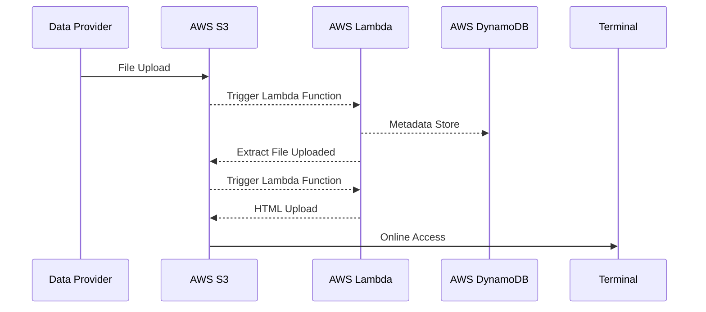

## Data workflow

!!! info "What is AWS CloudFormation?"
    Documentation available on [What is AWS CloudFormation? - AWS CloudFormation](https://docs.aws.amazon.com/AWSCloudFormation/latest/UserGuide/Welcome.html)

AWS CloudFormation is a service that helps you model and set up your AWS 
resources so that you can spend less time managing those resources and more 
time focusing on your applications that run in AWS. You create a template that 
describes all the AWS resources that you want (like Amazon EC2 instances or 
Amazon RDS DB instances), and CloudFormation takes care of provisioning and 
configuring those resources for you. You don't need to individually create and
configure AWS resources and figure out what's dependent on what; CloudFormation 
handles that. The following scenarios demonstrate how CloudFormation can help.